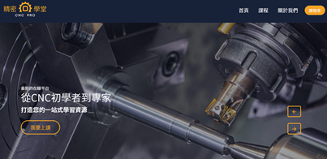

# CNC 課程電商網站
---
開發環境為 Vue3(Option API)、Vite，透過 Vue Router 進行路由建構。

## 開發語言

## Demo Link
- [前台](https://neil10241126.github.io/CNC-Website-Project/#/home)

## 專案技術

## 第三方服務
- axios / vue-axios
- bootstrap5
- vee-validate
- aos
- gsap
- sweetalert2
- pinia
- vite
## RESTful API
- 六角學院 - 課程 API